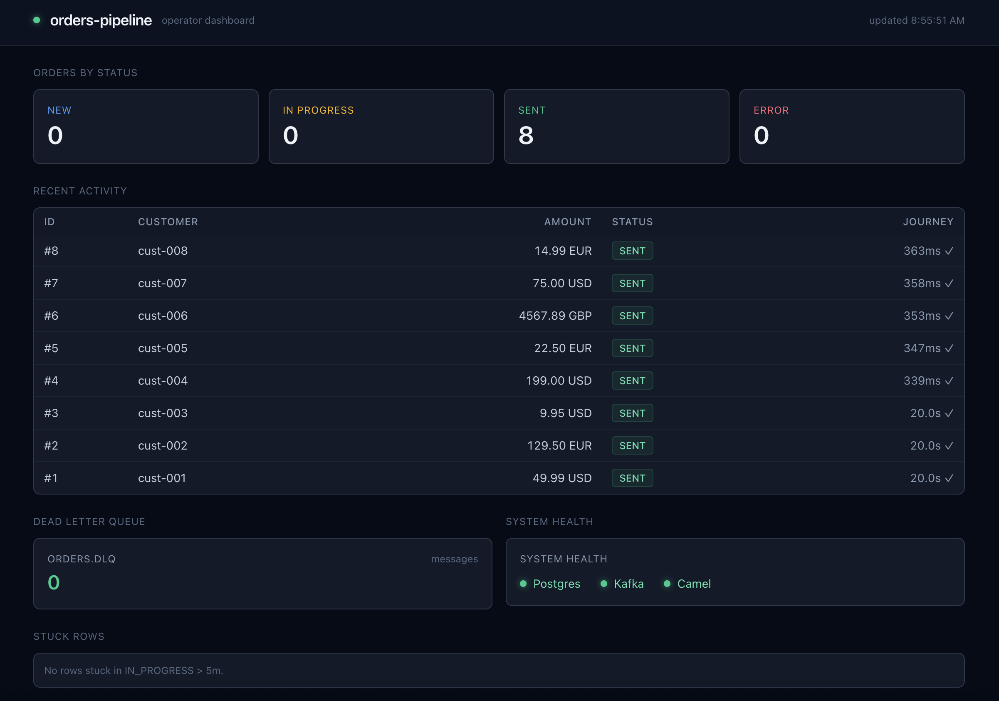

# orders-pipeline

> A Spring-Boot-free integration pipeline: Postgres → Apache Camel → Kafka.
> Built on `camel-main` to show idiomatic Apache Camel 4 without Spring on the classpath.

## Architecture

```
┌─────────────────────────┐       (every 2s)
│  Postgres               │ ──── claim NEW rows ────┐
│  orders table           │                         │
│  state machine:         │                         ▼
│  NEW → IN_PROGRESS →    │     ┌──────────────────────────────────┐
│  SENT or ERROR          │     │  Route: orders-postgres-to-kafka │
└─────────────────────────┘     │                                  │
            ▲                   │  1. SQL consumer (atomic claim)  │
            │                   │  2. OrderEnricher: Map → POJO    │
   onConsume│                   │  3. Jackson marshal: POJO → JSON │
   onConsumeFailed              │  4. Kafka producer               │
            │                   │                                  │
            └───────────────────┤  onConsume:       UPDATE → SENT  │
                                │  onConsumeFailed: UPDATE → ERROR │
                                └──────────────────┬───────────────┘
                                                   │
                                ┌──────────────────▼───────────────┐
                                │  Kafka topic: orders.new         │
                                │  key   = order id (partitioning) │
                                │  value = enriched JSON           │
                                └──────────────────────────────────┘
                                + DLQ: orders.dlq for poison messages
```

## Tech stack

| Layer            | Technology                       | Notes                                            |
|------------------|----------------------------------|--------------------------------------------------|
| JVM              | Java 17                          | LTS; Camel 4.x baseline                          |
| Integration      | Apache Camel 4.10                | `camel-main` standalone — no Spring              |
| DB source        | `camel-sql` + PostgreSQL 16      | Atomic-claim `UPDATE … RETURNING` pattern        |
| Connection pool  | HikariCP                         | Lifecycle owned by the Camel registry            |
| Sink             | `camel-kafka`                    | Idempotent producer, `acks=all`                  |
| Payload (v1)     | JSON via `camel-jackson`         | Avro + Schema Registry planned for v2            |
| Broker (dev)     | Redpanda 24.2                    | Single binary, Kafka-API-compatible              |
| UI (dev)         | Provectus Kafka UI               | Topic + message browser                          |
| Observability    | Camel dev console + Jolokia + health | Built-in HTTP surface, no extra deps         |

## Quick start

```bash
# 1. Start the local infrastructure (Postgres + Redpanda + Kafka UI)
docker compose up -d --wait

# 2. Run the pipeline (blocks until SIGTERM)
./mvnw camel:run
```

Within ~2 seconds the three seed orders flow to Kafka. Inspect a running app via:

- Camel dev console — <http://localhost:8080/q/dev>
- Health checks — <http://localhost:8080/observe/health>
- Kafka UI — <http://localhost:8081> → cluster `local` → topic `orders.new`

## Verifying end-to-end

```bash
# Watch all orders flip to SENT
psql -h localhost -U orders -d orders \
     -c "SELECT id, status, sent_at FROM orders ORDER BY id"

# Add a new order, then re-query — status flips to SENT within ~2s
psql -h localhost -U orders -d orders \
     -c "INSERT INTO orders (customer_id, amount, currency)
         VALUES ('cust-099', 19.99, 'USD')"

# Or tail the topic from the CLI
kcat -b localhost:9092 -t orders.new -C -o end -f '%k → %s\n'
```

### Failure-path smoke test

```bash
# 1. Take the broker down, then add an order
docker compose stop redpanda
psql -h localhost -U orders -d orders \
     -c "INSERT INTO orders (customer_id, amount, currency)
         VALUES ('cust-bad', 1.00, 'USD')"

# The route claims the row; the publish to orders.new fails fast (~5s),
# retries 3× with 2s backoff, the DLQ write to orders.dlq also fails,
# and onConsumeFailed marks the row ERROR -- recoverable, not lost:
psql -h localhost -U orders -d orders \
     -c "SELECT id, status FROM orders WHERE customer_id = 'cust-bad'"
#  -> status = ERROR

# 2. Bring the broker back and requeue the row
#    (the v1.2 reaper now automates this -- see the "Operational" section)
docker compose start redpanda
psql -h localhost -U orders -d orders \
     -c "UPDATE orders SET status='NEW', claimed_at=NULL, errored_at=NULL
         WHERE customer_id = 'cust-bad' AND status = 'ERROR'"
# Within one ~2s poll cycle it flows through to orders.new and SENT.
```

## Dashboard

Open <http://localhost:8080/dashboard> once `mvn camel:run` is up. A single-page HTMX + Tailwind dashboard polls the live system every two seconds:

- **State counts** — large counters for `NEW` / `IN_PROGRESS` / `SENT` / `ERROR`.
- **Recent activity** — the ten most recent orders with status badge and journey duration (`1.2s ✓`, `5m 12s ✗`, `in-flight 3s ago`).
- **Dead letter queue** — message count for `orders.dlq`.
- **System health** — green/red dots for Postgres, Kafka, and the Camel context (every route in `Started`).
- **Stuck rows** — a red banner when one or more `IN_PROGRESS` rows are older than five minutes. The reaper (see "Operational") will normally drain these automatically; the banner gives the operator visibility while it does so.

The header carries a live `updated HH:MM:SS` stamp that refreshes after every HTMX swap — proof of life beyond the counters.

<!-- TODO: capture a screenshot from a running instance and commit it as docs/dashboard.png -->


No build step: HTMX 1.9 and Tailwind both load via CDN. All API endpoints (`/api/stats`, `/api/recent`, `/api/dlq-size`, `/api/stuck`, `/api/health`) return HTML fragments rendered by `DashboardRoute` and `DashboardRenderer` — same camel-main process, no separate front-end app, no JSON-to-DOM glue.

## Operational

### Stuck-row reaper

The pipeline owns its recovery story. A timer-driven [`ReaperRoute`](src/main/java/io/github/leonardsibelius/orders/routes/ReaperRoute.java) ticks every `reaper.interval-ms` (default **60 s**) and finds rows in `IN_PROGRESS` whose `claimed_at` is older than `reaper.stuck-after-seconds` (default **300 s** / 5 min). For each such row it does one of two things:

- **Reclaim** (the common case): `UPDATE … SET status='NEW', claimed_at=NULL, claim_count = claim_count + 1`. The SQL consumer's next poll picks the row up normally. A WARN is logged with the order id, the seconds it was stuck, and the new `claim_count`.
- **Poison** (when `claim_count + 1 > reaper.max-claims`, default **5**): `UPDATE … SET status='ERROR', errored_at=NOW(), error_reason='stuck-too-many-times', claim_count = claim_count + 1`. Prevents an infinite reclaim loop on a row that genuinely never publishes — the dashboard's stuck-rows panel surfaces it for human attention.

The choice between reclaim and poison is a typed Java predicate (`ReaperRoute#isPoison`), not a Simple-language string comparison — checked at compile time, not at runtime. Each UPDATE includes an `AND status='IN_PROGRESS'` guard so the reaper no-ops cleanly if another actor (a parallel reaper, the SQL consumer, or a human via psql) changed the row between SELECT and UPDATE.

A 10-second `reaper.initial-delay-ms` defers the first tick so any pre-existing `NEW` rows at startup get claimed through the regular pipeline first.

| Config knob | Default | What it controls |
|---|---|---|
| `reaper.interval-ms` | `60000` | Timer period between reaper ticks |
| `reaper.initial-delay-ms` | `10000` | Delay before the first tick after startup |
| `reaper.stuck-after-seconds` | `300` | How long a row must sit `IN_PROGRESS` before the reaper considers it stuck |
| `reaper.max-claims` | `5` | Reclaim attempts allowed before the row is marked `ERROR` |

### Testing the reaper

When scripting a smoke test for the reaper, your watchdog timeout must be **at least one full `reaper.interval-ms`** (plus a small buffer for the SELECT + UPDATE roundtrip). With the default `60000`, allow ~70 seconds of wait per stuck row.

The reclaim after a stick can land *up to one full tick later* — not immediately — because the previous tick may have fired (and found nothing) milliseconds before you stuck the row. A watchdog timeout shorter than one tick will report "no reclaim" while the system is actually working correctly. Learned this the hard way during the v1.2 smoke test.

## Design notes

### Why `camel-main`, not Spring Boot?

This is a single-purpose integration process — one route, one DB, one broker. Spring Boot's auto-configuration solves problems we don't have, while `camel-main` gives us classpath scanning, properties, lifecycle, dev console, health checks, JMX-over-HTTP, and CLI attachment without the dependency surface. There are zero Spring artifacts on the classpath.

### Why an atomic-claim `UPDATE … RETURNING`, not `SELECT … FOR UPDATE`?

A plain `SELECT … FOR UPDATE SKIP LOCKED` is multi-instance safe only if the SELECT and the subsequent UPDATE share a transaction — otherwise the lock is released the instant the SELECT returns and concurrent pollers race for the same rows. Sharing a real transaction in `camel-sql` requires a Spring `PlatformTransactionManager`. To stay Spring-free, we use Postgres's atomic UPDATE-with-RETURNING idiom in [`claim-new-orders.sql`](src/main/resources/sql/claim-new-orders.sql): a single statement that flips status to `IN_PROGRESS` *and* returns the row data. The `FOR UPDATE SKIP LOCKED` inside the subquery still makes the row selection concurrency-safe; the outer UPDATE makes the claim durable in one statement.

### DLQ-first error handling

The route-level `errorHandler(deadLetterChannel(...))` retries transient failures 3× with 2s backoff, then routes the failed exchange to `orders.dlq`. When that DLQ write **succeeds**, `deadLetterChannel` marks the exchange handled, so `camel-sql`'s `onConsume` fires and the row flips to `SENT` — the DLQ topic, not Postgres, is where downstream investigation happens.

When the broker is *fully* unavailable the DLQ write fails too. `.deadLetterHandleNewException(false)` makes that second failure propagate instead of being swallowed, so `camel-sql` runs `onConsumeFailed` and the row is marked `ERROR` — recoverable by requeuing it to `NEW`, never silently `SENT` while the event was lost. Kafka producer timeouts are tuned short (`delivery-timeout-ms=10s`) so this path resolves in seconds rather than minutes.

### Why `OrderEvent` doesn't carry `status`

The DB `status` column tracks the pipeline's *internal* lifecycle (`NEW` / `IN_PROGRESS` / `SENT` / `ERROR`) — it's a producer concern, not an order property. Including it would mean every Kafka event carries `"status": "IN_PROGRESS"`, which is misleading: by the time a consumer sees the message, the row is already `SENT`. The published event represents the order, not the pipeline. A future business-level status (e.g. `PENDING` / `CONFIRMED` / `SHIPPED`) would live in a separate column and *would* belong on `OrderEvent`.

### The orders state machine

```
              ┌────────┐    claim     ┌─────────────┐   onConsume     ┌────────┐
INSERT  ───►  │  NEW   │  ──────────► │ IN_PROGRESS │ ──────────────► │  SENT  │
              └────────┘              └─────────────┘                 └────────┘
                  ▲                          │
                  │                          │ onConsumeFailed
   stuck-row      │                          │ (catastrophe)
   reaper         │                          ▼
                  │                     ┌─────────┐
                  └─────────────────────│  ERROR  │
                                        └─────────┘
```

## Known limits

- **JSON payload.** Friendly for `kcat` debugging, less friendly for schema evolution. **v2.0** swaps to Avro + Confluent Schema Registry.
- **No metrics export.** Camel's dev console gives runtime introspection; Micrometer + Prometheus is a **v2.1** candidate.
- **Schema changes via `init.sql` only.** New columns land by folding into `db/init.sql` and recreating the Postgres container (`docker compose down && up`). Real migration tooling (Flyway / Liquibase) is a v2.x concern.

## Roadmap

| Tag  | Change                                       | Why                                                |
|------|----------------------------------------------|----------------------------------------------------|
| v1.0 ✓ | Working end-to-end on JSON                 | The canonical shape of a `camel-main` pipeline     |
| v1.1 ✓ | Operator dashboard (HTMX + Tailwind)       | At-a-glance pipeline state, served by camel-main from the same JVM |
| v1.2 ✓ | Stuck-`IN_PROGRESS` reaper route           | Recover from consumer crashes without manual fix   |
| v2.0   | Avro + Confluent Schema Registry           | Schema-evolution discipline on the wire format     |
| v2.1   | Micrometer metrics + Grafana dashboard     | Per-route latency / throughput / DLQ-rate panels   |

The git history is intentionally narrative — each tag above will be its own series of small commits that show why the change was needed.

## File layout

```
orders-pipeline/
├── pom.xml                              # camel-main + camel-sql + camel-kafka + camel-jackson
├── docker-compose.yml                   # Postgres + Redpanda + Kafka UI for local dev
├── db/
│   └── init.sql                         # orders schema + partial index + seed rows
└── src/main/
    ├── java/io/github/leonardsibelius/orders/
    │   ├── PipelineApplication.java     # camel-main bootstrap
    │   ├── PipelineConfiguration.java   # @BindToRegistry: DataSource, ObjectMapper, kafkaTopicStats
    │   ├── routes/
    │   │   ├── OrderSyncRoute.java      # the pipeline route
    │   │   ├── DashboardRoute.java      # /dashboard + /api/* endpoints
    │   │   └── ReaperRoute.java         # stuck-row reaper (v1.2)
    │   ├── transform/
    │   │   ├── OrderEvent.java          # Kafka payload (Java 17 record)
    │   │   └── OrderEnricher.java       # Map<String,Object> → OrderEvent
    │   └── dashboard/
    │       ├── DashboardRenderer.java   # pure HTML-fragment functions
    │       ├── KafkaTopicStats.java     # AdminClient wrapper (DLQ size + reachability)
    │       └── HealthChecker.java       # Postgres + Kafka + Camel reachability
    └── resources/
        ├── application.properties       # all runtime config
        ├── log4j2.properties            # logging
        ├── static/
        │   └── index.html               # HTMX + Tailwind dashboard SPA
        └── sql/
            ├── claim-new-orders.sql     # UPDATE…RETURNING atomic claim
            ├── mark-order-sent.sql      # onConsume:       IN_PROGRESS → SENT
            ├── mark-order-failed.sql    # onConsumeFailed: IN_PROGRESS → ERROR
            ├── dashboard-stats.sql      # counts by status
            ├── dashboard-recent.sql     # 10 most recent orders
            ├── dashboard-stuck.sql      # count of stuck IN_PROGRESS rows
            ├── reaper-find-stuck.sql    # SELECT stuck rows + how long
            ├── reaper-reclaim.sql       # UPDATE: stuck IN_PROGRESS → NEW
            └── reaper-mark-poison.sql   # UPDATE: stuck → ERROR (max-claims exceeded)
```

## License

MIT — see [LICENSE](LICENSE).

This project was built with [Claude Code](https://claude.com/claude-code) (Anthropic) as a pair-programming collaborator. Design decisions and trade-offs are recorded in the commit messages.
